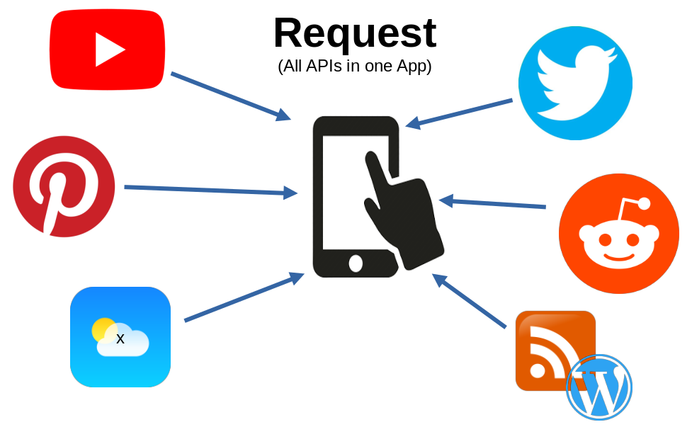
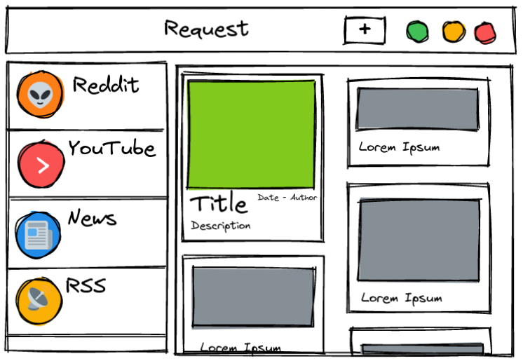

# Request 📱

> All APIs (social media, news, RSS, ...) in one App. 

## About

`Request` is a graphical program that shows posts from your favorite social media platforms, news sites, RSS-Feeds in a united way. 

Websites and Apps need an account, load to long, show advertisements, pop-ups and track you. `Request` shall be a solution that fixes the bloated web temporarily. 

### Goals 🏁

- [ ] uniform (customizable) appearance 🧚
- [ ] no advertisement 🛑
- [ ] less surveillance 🕵

### Reason ⛓

- Websites are getting bigger and take longer to load 📦⏰
- Every site looks different (bad for old people 👴)
- Content gets hidden by advertisement and pop-ups 📰
- Social Media tracks you 👹

## Usage

- Input a URL of an API and a JSON-transformtion 🗜
- View posts of different platforms in one convenient feed. 📜

## Technologies

- Python3 🐍
- GTK3 📰
- grequests 📲
- jmespath 🗜

## Inspiration

- [NewPipe](https://newpipe.net/) _- YouTube, PeerTube Client_
- [Barinsta](https://barinsta.austinhuang.me/en/latest/) _- Instagram-Client_
- [Slide](https://github.com/ccrama/Slide) _- Reddit-Client_
- [Gemini-](https://gemini.circumlunar.space/), [Gopher-Protokoll](https://en.wikipedia.org/wiki/Gopher_%28protocol%29), Markdown

## Authors

- **Gero Beckmann** - _Initiator_ - [Geronymos](https://github.com/Geronymos)

## License

This project is licensed under the GPT-3 License - see the `LICENSE` file for details